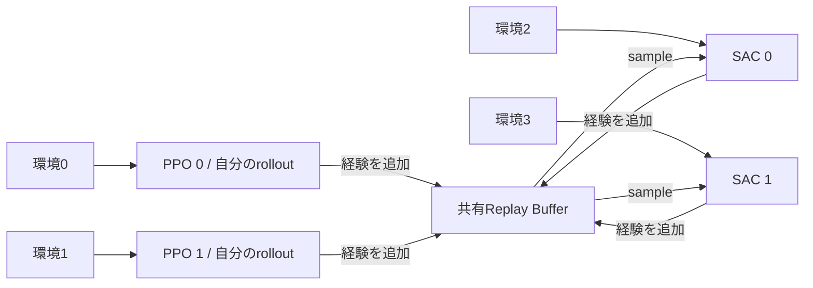

## はじめに

個人開発しているRust製の強化学習フレームワーク、ReinforceXにPythonから学習させるためのFFIを整備したので、今回はその設計と実際に学習させてみた結果を紹介します。

[前回の記事](https://zenn.dev/kakky_hacker/articles/652bd7f9a1e6c1)では、RustからGymnasiumを呼び出してDQNを動かしました。今回は呼び出す向きを逆にして、環境はPython、エージェントの学習処理はRustに置いています。

これにより、Gymnasiumの環境やPythonで書いた独自環境を使いながら、Rust側のエージェント、Replay Buffer、好奇心モジュールを組み合わせられるようになりました。特に面白いと思っているのが、**PPOとSACを同時に動かして経験を共有する構成**と、**複数のPPOでRNDを共有する構成**です。

gitレポジトリは[こちら](https://github.com/kakky-hacker/reinforcex)です。まだ開発中ですが、使ってみたり実装を覗いてもらえると嬉しいです！

Rust、Python、PPOやSACの基本的な知識はある程度ある前提で、今回はFFIの境界や並列実行時の扱いを中心に見ていきます。

※ 本記事は2026年10月1日時点の開発版と、そこまでに完了したCPU実験についての記録です。掲載した変更がすべてcrates.ioの公開済みバージョンに含まれるという意味ではありません。

## まずはPythonからCartPoleを学習させてみる

最初に動かすのはPPOによるCartPoleです。リポジトリにはPythonの学習スクリプトを用意しています。

Rust 1.88以上とPython 3.11の環境を使い、リポジトリのルートで以下を実行します。これはmacOSの例です。Linuxでは共有ライブラリ名を`libreinforcex.so`、Windowsでは`reinforcex.dll`に読み替えてください。`tch` 0.20に対応するLibTorchは2.7.0です。LibTorchの検索パスなど、OSごとの設定はREADMEを参照してください。

```bash
python -m pip install -r benchmarks/native_requirements.txt
cargo build --locked --release -p reinforcex_ffi

REINFORCEX_LIB="$PWD/target/release/libreinforcex.dylib" \
OMP_NUM_THREADS=1 MKL_NUM_THREADS=1 OPENBLAS_NUM_THREADS=1 VECLIB_MAXIMUM_THREADS=1 \
python examples/train_cartpole_ppo_ffi.py \
  --steps-per-agent 204800 \
  --seed 42 \
  --save-path artifacts/cartpole_ppo.ot \
  --results-path artifacts/cartpole_ppo_results.json
```

このスクリプトでは、指定したstep数まで学習した後、最後のモデルを100 episode評価します。学習途中に良かったモデルを選ぶ処理は入れていません。`results-path`には学習中のepisodeごとの報酬と、最終評価の結果が保存されます（既存の結果ファイルは上書きしません）。

以下は、設定を決めた後に未使用のtraining seedを5つ用意して測った学習曲線です。上のコマンドのseed 42とは別の試験になります。


横軸はepisode、縦軸は加工していない環境報酬です。薄線が各episode、太線が100 episode移動平均です。step予算で途中終了したepisodeは移動平均から除いています。

5つのモデルは、最後の100 episode評価でいずれも平均500になりました。保存したモデルを別プロセスで読み直した場合も、全500 episodeで報酬とepisode長が一致しています。

ここまではPythonの学習スクリプトに見えますが、ニューラルネットワークとoptimizerはRust側にあります。では、どのように呼び出しているのかを見ていきましょう。

## FFIの境界を小さくする

全体の構成は以下です。


環境のresetやstep、観測の加工、学習率scheduleはPython側に置いています。一方、モデル、optimizer、PPOのrollout、Replay Buffer、RNDの更新はRust側です。Python側でPyTorchのモデルを作ってRustへ渡す構成ではありません。

### Rustのオブジェクトを直接渡さず、handleで操作する

C ABIでは、エージェントを`uint64_t`のhandleで指定します。Rust側の`Tensor`やtrait objectを、そのままPythonへ公開しないようにしました。

内部のエージェント管理は、おおよそ次の型になっています。

```rust
static AGENTS: LazyLock<DashMap<u64, Arc<Mutex<AgentWrapper>>>> =
    LazyLock::new(DashMap::new);
```

handleから`Arc`を取得したら、registryへの参照は解放し、そのエージェントの`Mutex`を取得して処理します。重い学習処理の間、registry全体をロックし続ける構成にはしていません。

Replay BufferとRNDにも個別のhandleがあります。エージェントは必要なオブジェクトの`Arc`を保持するため、外部の共有buffer handleを先に解放しても、既に接続されたエージェントが使っている実体は残ります。handleの寿命と、内部オブジェクトの寿命を分けているわけです。

観測・行動は、要素数を伴う配列として受け渡します。Python側の配列を無条件にゼロコピーで保持する設計ではなく、Rust側で必要なTensorへ変換します。ここではコピーをなくすことより、呼び出し元の配列の寿命に依存させないことを優先しました。

### APIで報酬を渡すタイミング

Python adapterでの基本的な呼び出しは、以下の3つです。

```python
action = agent.act_and_train(observation, previous_reward)
agent.stop_episode(last_observation, last_reward, terminated=True)
action = agent.act(observation)  # 評価用
```

`act_and_train`へ渡す報酬は、**直前の行動で得た報酬**です。reset直後には0を渡し、episodeの最後の報酬は`stop_episode`へ渡します。この対応がずれると、Rust側の計算が正しくても別の遷移を学習してしまいます。

また、Gymnasiumの`terminated`と`truncated`は区別しています。環境の終端ならbootstrapを止めますが、時間制限などによる打ち切りでは最後の観測からbootstrapする必要があります。単に`done = terminated or truncated`だけをRustへ渡すと、この違いが消えてしまいます。

FFIの入口では、handle、配列長、設定値、非有限な観測・報酬などを検査します。Rust側で発生したpanicも、境界で捕捉してエラーコードへ変換します。ただし、panicした学習を丸ごと巻き戻せるわけではありません。内部のMutexがpoisonされたエージェントは破棄して作り直す扱いです。

### 既存のC構造体を伸ばさない

今回PPOにモデル選択などの設定を追加しましたが、既存の`RxPpoConfig`の末尾へフィールドを足すことはしませんでした。古いPythonやCの呼び出し元が、古いサイズの構造体を渡してくるためです。

代わりに`RxPpoConfigV2`と`rx_ppo_create_v2`を追加しています。旧APIは旧モデルを使い、新モデルは明示的に選択します。今回の64bit環境では旧構造体152 byte、新構造体184 byteで、サイズとoffsetも検証しています。

FFIを作るときは関数の呼び出しだけでなく、**後から設定を増やすときに既存の呼び出し元を壊さないこと**も考えておく必要がありました。

## 並列学習で共有するもの、各エージェントが持つもの

ReinforceXの並列workerは、それぞれモデルとoptimizerを持ちます。一つのPPOに複数環境の観測をまとめて投入するvectorized環境とは構成が異なります。

Python側では複数の環境ループをthreadで実行し、それぞれのエージェントを呼び出します。`ctypes.CDLL`によるネイティブ関数の呼び出し中はGILが解放されるため、Rust側の処理は並行して進められます。ただしPythonで書いた環境処理まで常に並列化される、という意味ではありません。[Pythonのctypesドキュメント](https://docs.python.org/3/library/ctypes.html#ctypes.CDLL)

ここで共有する対象を、モデルとは別に選べるようにしています。

| 対象 | 持ち方 |
|---|---|
| policy・value・optimizer | 各エージェントが所有 |
| PPOのon-policy rollout | 各PPOが所有 |
| off-policy用Replay Buffer | 複数エージェントで共有可能 |
| RND | 各PPO専用にも、複数PPOでの共有にもできる |

### PPOが集めた経験をSACへ渡す

HalfCheetahのhybrid構成では、PPO 2体とSAC 2体を動かしています。各PPOは自分のrolloutで更新し、その経験を共有Replay Bufferにも出力します。SACは共有bufferから学習します。



PPOがSACの古い経験を読んで更新するわけではありません。on-policyであるPPOの更新条件は維持しつつ、収集済みの経験をSACでも使えるようにしています。

共有bufferでは、別workerのepisodeをつなげてn-step returnを作らないことも必要です。episodeごとに識別子を持ち、未確定の遷移を分離して管理しています。単に経験を一つのqueueへ追加するだけでは、並列化した際に別の環境の報酬を混ぜてしまいます。

### 正規化したPPOの入力を、そのまま共有しない

ここは今回の実装で特に気を付けた部分です。

HalfCheetahのPPOには観測と報酬の正規化を入れました。しかし、PPOに渡した正規化済みの値をそのままReplay Bufferへ追加すると、SAC自身が追加する元の値と混在します。さらにPPOごとに正規化統計が違えば、同じ物理状態でも異なる数値になります。

そこで、PPOへの学習入力と、共有replayへ追加する入力を分けるAPIを用意しました。

```text
元の観測・外部報酬
  ├─ 正規化 → PPOのrollout・GAE・更新
  └─ 元の値 → 共有Replay Buffer → SAC
```

Pythonでは次のように指定します。以下は`lib`、PPO V2の`config`、共有`replay`が作成済みの部分を抜粋したものです。

```python
from reinforcex_ffi import create_ppo
from reinforcex_normalization import NormalizedAgent

ppo = create_ppo(lib, config, save_path=None, load_path=None, replay=replay)
ppo = NormalizedAgent(
    ppo,
    observation_size=17,
    gamma=0.99,
    normalize_observations=True,
    normalize_rewards=True,
    preserve_replay_inputs=True,
)
```

正規化統計は各PPOが持ち、評価時には更新しません。観測は平均と標準偏差で、報酬はdiscounted returnの標準偏差で正規化します。報酬の平均を引く処理はしていません。

また、連続PPOでは尤度の計算に使うGaussianの元のactionを保持し、環境と共有replayには範囲内へclipした実行actionを渡します。**学習で必要な値と、他のエージェントへ渡す値を同一視しない**ことが、この構成のポイントです。

## RNDによる好奇心も共有できる

RND（Random Network Distillation）は、固定したランダムネットワークの出力をpredictorで予測し、その誤差を好奇心報酬として使います。基本的な考え方は[元論文](https://arxiv.org/abs/1810.12894)を参照してください。

ReinforceXの実装では、特徴量方向の平均二乗誤差を使っています。次の状態についての誤差を`e`、好奇心係数を`β`とすると、PPOで使う報酬は以下です。

$$
e(s_{t+1}) = \frac{1}{d}\sum_{j=1}^{d}
\left(\hat f_j(s_{t+1})-f_j(s_{t+1})\right)^2
$$

$$
r_t^{\mathrm{PPO}} = r_t^{\mathrm{ext}} + \beta e(s_{t+1})
$$

targetとpredictorは別の`VarStore`を持ちます。optimizerにはpredictorだけを登録し、targetのforwardでは勾配を作りません。保存時には両方の重みを残します。predictorだけを復元してtargetを新しくランダム初期化すると、好奇心の基準そのものが変わってしまうためです。

### 「報酬を計算する→predictorを更新する」を一つの処理にする

共有RNDでは、単に各メソッドを個別にlockするだけでは不十分でした。

```text
worker A: 好奇心報酬を計算
worker B: predictorを更新
worker A: predictorを更新
```

このように途中へ別workerの更新が入ると、worker Aの報酬計算とpredictor更新の間でモデルが変わります。

そのため、共有RNDでは`calc_internal_reward_and_update`を一つのMutex区間として扱います。**更新前のpredictorで報酬を求め、その後にpredictorを学習する**順序を保っています。lockを取る順番まで決定的にしているわけではありません。

PPOのGAEに加える好奇心報酬は、共有Replay Bufferへは出力しません。SACには外部報酬だけを渡します。predictorの学習とともに意味が変わる好奇心報酬を、SACのreplayへ暗黙に混ぜないためです。

RNDを各worker専用にすると「そのworkerにとって新しいか」、共有すると「共有predictorがまだ学習できていないか」が探索の基準になります。どちらが良いかは環境によるため、共有を固定せず選べるようにしました。

### RNDを付ければ自動的に良くなる、とは限らない

今回確認したのは、targetが学習で変化しないこと、predictorが更新されること、末尾の短いminibatchを落とさないこと、保存復元、共有時の処理順などです。

観測の単位にも注意が必要でした。現在のRNDは、生の予測誤差を返す比較的単純な実装で、RND専用の観測・intrinsic reward正規化を内蔵していません。初期のReLUネットワークを使ったテストでは、観測を1000倍にすると誤差がおよそ100万倍になりました。

このため、環境を変えるときには観測のスケールと`β`を合わせて確認する必要があります。特に異なる正規化統計を持つworkerへ同じRNDを接続するなら、RNDへ何を入力するかも揃える必要があります。PPO向けの正規化wrapperがあることと、RND全体のスケール調整が済んでいることは別です。

## 学習させて分かったcore側の修正点

FFIで呼び出せるだけでは、十分に学習できるとは限りませんでした。実験と実装の確認を進める中で、PPOのモデルと更新処理、数値計算をいくつか変更しています。

### PPOのactorとvalueを分ける

新しく追加した`FCPpoPolicy`では、actorとvalueを別々のMLPにしました。隠れ層はTanhまたはReLUを選べ、直交初期化のgainは隠れ層`√2`、policy出力`0.01`、value出力`1`です。

連続行動では、meanは線形出力、`log_std`は観測に依存しない学習パラメータにしています。HalfCheetahでは初期`log_std=-1`の候補を試しました。旧モデルの観測依存の分散と分けて、初期の探索量を調整できるようになります。

更新処理では、epoch内でrolloutを一度ずつ走査し、短い最後のminibatchを重複サンプルで埋めないようにしました。`value_clip_range=0`は「value clippingを無効にする」と定義し直しています。0幅のclippingと無効化は同じではありません。

さらに、近似KLが指定した`target_kl`の1.5倍を超えたら、そのminibatch以降の更新を停止できるようにしました。既に適用した更新の巻き戻しはしません。近似KL、clip fraction、実際のoptimizer step数も統計として取り出せます。

CartPoleでは、Adamを作り直さず学習率だけを線形に下げるAPIも使っています。optimizerの状態を保持したまま、後半の更新幅を小さくするためです。

### SACのtanh補正を安定した式へ置き換える

連続行動SACでsquashを有効にした場合、actionは`tanh(u)`で作るため、log probabilityには変数変換の補正が必要です。以前の`log(1 - tanh(u)^2 + ε)`では、`tanh(u)`が浮動小数点上で±1になると、補正項の勾配が適切に計算できなくなります。

そこで、補正項を次の形へ変更しました。

$$
\log(1-\tanh^2(u))
=2\left(\log 2-u-\mathrm{softplus}(-2u)\right)
$$

[Spinning UpのSAC実装](https://github.com/openai/spinningup/blob/master/spinup/algos/pytorch/sac/core.py)でも使われている式です。飽和域の値と勾配をテストしましたが、この修正だけでHopperが解ける、という結果にはなっていません。

### panicの後にもautogradの状態を戻す

少しRustらしい修正もありました。利用している`tch` 0.20のclosure版`no_grad`は、closure内でpanicすると、元のgrad modeへ戻る処理を通りません。

FFIでそのpanicを捕捉しても、同じthreadで次に動かす別のエージェントまで勾配無効の状態になり得ます。実際にエラーを起こした後、次のbackwardが失敗するケースをテストで再現しました。

現在は、coreから直接使うscopeを次のhelperへ移しています。

```rust
pub(crate) fn no_grad<T>(operation: impl FnOnce() -> T) -> T {
    let _guard = tch::no_grad_guard();
    operation()
}
```

RAIIのguardを使うことで、正常終了時もRustのstack unwinding時も元の状態へ戻せます。FFIでエラーを返すことに加えて、呼び出し後のthreadの状態も考える必要がありました。

また、有限なf32勾配でもnormの二乗和がoverflowするケースがあったため、gradient normはf64で集計する共通処理へ移しました。例えば`[1e20, -1e20]`は各要素が有限でも、f32で求めたnormは無限大になり得ます。

これらの数値不具合は再現テストで確認したものです。一方で、Hopperの性能不足がこれらだけで説明できる証拠はありません。**修正が必要な不具合と、学習結果を改善した要因は分けて考えています。**

## CPUで測ったベンチマーク結果

測定環境はApple M2 Pro、GPUは使わずCPUのみです。Gymnasium 1.3.0、MuJoCo 3.13.0を使いました。native側はLibTorch 2.7.0、比較用のStable-Baselines3（以下SB3）は2.9.0／PyTorch 2.14.0で、別プロセスに分けています。

できるだけ同じ条件で比較するため、環境のバージョン、step予算、報酬加工、ネットワークの幅・深さ、学習率などを合わせました。ただし、初期化、advantage標準化、乱数、更新順序まで同じ実装ではありません。

`hidden_layers=1`が「最初の隠れ層に加えて1層」、つまり実際には2層を意味する点も、比較時に揃えています。

評価方法は、最後のcheckpointを、探索ノイズを入れない行動で100 episode動かし、**元の環境報酬**を集計するものです。学習に使った加工済み報酬やRNDの報酬は、合否の報酬へ足していません。

### CartPole PPO

採用した設定はseparate Tanh・2層×64、rollout 256、6 epochs、minibatch 64、学習率`5e-4 → 2.5e-5`です。学習時の報酬は、通常`0.01 × reward`、500stepより前の失敗時は`-1`に加工しています。最終評価は通常のCartPoleの報酬です。

| training seed | 学習step | 最終100 episodeの平均 | 基準475 |
|---:|---:|---:|---|
| 17 | 204,800 | 500.00 | 達成 |
| 137 | 204,800 | 500.00 | 達成 |
| 307 | 204,800 | 500.00 | 達成 |
| 701 | 204,800 | 500.00 | 達成 |
| 1301 | 204,800 | 500.00 | 達成 |

これは15個の開発seedで設定を選んだ後、別のtraining seedと評価seedで確認した結果です。SB3との同設定の開発3seed比較でも、両方とも平均500でした。CartPoleの上限に達した結果であり、これをもってSB3より優れているとは言えません。

なお、先の候補では確認seedの一つが436.37になっていました。その結果も残して再調整しています。「最初からすべてのseedで安定した」という経緯ではありません。

上表の学習は保存したv3 buildによるものです。その後の数値安全性修正を含むv4でも、これらの保存モデルの推論一致と、実exampleの単体・2並列での新規学習を確認し、3 workerとも最終平均500でした。v4で同じ5seedを再学習した結果と混同しないようにしています。

### HalfCheetahのPPO＋SAC

本来の2 PPO＋2 SAC構成で、各worker 1,024,000step、合計4,096,000step学習した結果です。保存した`core_v2_checked` build、training seed 1001の試行で、各workerのseedは記録した規則に従って分けています。

| worker | アルゴリズム | 最終100 episodeの平均 |
|---|---|---:|
| 0 | PPO | 4,816.44 |
| 1 | PPO | 5,682.71 |
| 2 | SAC | 11,246.87 |
| 3 | SAC | 11,327.38 |

この試行では、PPO 2体が両方とも基準の4,800を超えました！


ただし、これは**1つのtraining seed組での開発結果**です。PPO 0は基準との差が約16点なので、複数seedで十分安定したとまでは言えません。グラフは探索を含む学習中の報酬で、表の決定的な最終評価とは異なります。

この構成のPPOはseparate Tanh・2層×256、初期`log_std=-1`、観測・報酬正規化、`target_kl=0.02`、定数学習率`3e-4`です。共有replayには正規化前の入力を渡しています。

別に行った単独PPOの試験では、各2,048,000stepで学習率を`3e-4 → 1.5e-5`へ下げると、開発3seedで6,877.42／6,796.81／6,049.69になりました。ただし、単独PPOは共有replayのあるhybridとは別の条件です。この数字をhybridの追加seedとして数えてはいません。

長い予算のhybridや旧実装の同予算対照には、記事の集計時点で未完了の試行もあります。モデル変更、正規化、設定、学習量を合わせた結果なので、特定のcore修正一つだけの効果とも言えません。

### Hopper SACと、未解決の部分

Hopperは、今回まだ基準の3,800に届いていません。raw reward、2層×128、batch 128、2,048,000stepの対応条件では以下でした。

| 実装 | 最終100 episodeの平均 |
|---|---:|
| 今回の修正開始時点のnative | 1,620.94 |
| 数値修正を加えたnative（v1） | 3,235.55 |
| 同設定へ合わせたSB3 | 1,924.56 |

各1 training seedの結果です。batch sizeやネットワーク構成を変えた未完了の試験は、この表に混ぜていません。ここでも「nativeならHopperが安定して解ける」とはまだ言えない状態です。

CartPole DQNも達成確認には至らず、今回は調査を区切りました。v3のtarget同期間隔を調整した候補は開発15seedで基準を超えましたが、v4での再学習3seedは453.41／500／500でした。MSE損失も隔離した実験では試したものの、正式には採用していません。現行coreのDQNはHuber損失のままです。

### RNDを共有した場合

LunarLanderでは、PPO＋RNDを2 workerで動かし、RNDを各worker専用にした場合と共有した場合を比較しました。総予算は2,048,000stepで、各worker 1,024,000stepです。

| RNDの持ち方 | 開始時点の版：worker 0 / 1 | 改修版（core_v2_checked）：worker 0 / 1 |
|---|---:|---:|
| 各worker専用 | 259.58 / 223.72 | 270.94 / 247.80 |
| 2 workerで共有 | 256.87 / 165.68 | 257.35 / 232.39 |

各値は最終raw 100 episodeの平均です。この表ではlegacyのPPOモデル、`β=0.01`、加工していない外部報酬を使っています。こちらも1つのtraining seed組での回帰試験で、共有RNDが常に有利という比較ではありません。また、この表の開始時点の版と改修版の間では、RND本体の算法は変えていません。PPOなどの変更を含む回帰確認として読んでください。

保存したRND付きモデルの確認では、単独・並列構成の10 policyを別プロセスで復元し、合計1,000 episodeでpolicyの報酬・episode長が一致しました。ただし通常のpolicy推論はRNDを使わないので、この一致だけでRNDの内部状態や学習再開まで検証できたわけではありません。RNDのtarget／predictor保存復元は、別途モデルの誤差出力を比べるテストで確認しています。

### 再現性について

モデルと一緒に正規化統計や学習率scheduleを保存しますが、optimizer、Replay Buffer、乱数状態、実行中の環境まで保存する完全な学習resumeは、まだ対応していません。

また、`manual_seed`で設定するのはTorchの乱数です。探索・replay抽出・minibatchの並べ替えには未固定のRust乱数も使うため、同じseedの再学習や並列実行が完全に一致する保証はありません。

そのため、保存モデルを読み直して同じ推論ができることと、最初から同じ学習過程を再現できることは分けて検証しています。CPUの学習ジョブも同時に動かしているので、今回の経過時間をRustとPythonの速度比較には使っていません。

## おわりに

今回はReinforceXをPythonから使うFFIと、共有Replay Buffer、RNDを組み合わせた学習について紹介しました。

実装してみると、並列処理ではlockを付けるだけでなく、episodeの境界、正規化する前後の値、報酬を計算するタイミングまで揃える必要がありました。FFIも同様で、関数を呼び出せるところから、長い学習を動かして保存・評価できるところまでには、確認することが色々あります。

CartPole PPOでは安定した結果が得られ、HalfCheetahでもPPOとSACを同時に学習させられるところまで来ました。一方でHopperやDQNには課題が残っているので、このあたりも少しずつ改善していきたいと思っています。

Pythonの環境資産を使いつつ、学習側の部品をRustで組み合わせられる点が、このライブラリの面白いところだと感じています。Rustで強化学習の実装やシミュレータとの連携に興味がある方は、ぜひ触ってみてください！
